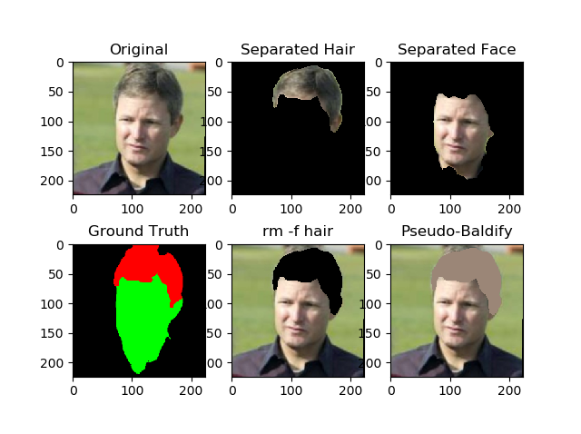

A convolutional neural network (CNN) that can detect a person's face and
distinguish between their face and their hair. It was successfully able to
accomplish this task in real time.

It was originally going to be a component in an image processing pipeline that
would allow the user to simulate different hairstyles. The missing components
for this were:

- Another neural network that determined face pose from images, and
- A program that takes this hair detector's results, takes the face pose
  results, and replaces the user's hair with a 3D hair model.

## The network

The network was inspired by the existing
[VOC-fcn8s](https://github.com/shelhamer/fcn.berkeleyvision.org/tree/master/voc-fcn8s)
network, though I reduced some of the layer count parameters to make it run
faster on my machine.

Essentially, this network is a member of the family of networks known as **Fully
Convolutional Networks**, or FCNs. As their name suggests, they are only
composed of convolutional or deconvolutional layers.

In terms of architecture, it's a lot like an autoencoder. See the following
graphic[^cite1] for an illustration. It shrinks the data down to a manageable
size using convolutional and pooling layers. When it's very small (7x7) it
performs scoring with the center layers. In the final layers, it rescales the
scores back to original size by adding data gathered from the shrinking.

[^cite1]:
    "Fully convolutional neural network architecture (FCN-8)" by Piramanayagam
    et al. is licensed under
    [CC BY 4.0](https://creativecommons.org/licenses/by/4.0/)

## Improving results with synthetic data

There were many issues encountered in some of the earlier trained networks, but
they were easily solved by training on a synthetic dataset generated from my
training data.
[`util.py`](https://github.com/astralbijection/Hair-Net/blob/master/util.py)
contains most of the code used to do this.

- **Sometimes the neural network would detect a person in an image of a wall, a
  _false positive_** - I took some random images without people's faces in them
  and added them to the dataset as features, with a blank target.
- **If the person wasn't in the center of the camera, there would be less
  accuracy** - I randomly scaled and translated training features, and applied
  the same operation to their associated targets. I tried rotating the images at
  some point, but found that to be a bit difficult to implement at the time.
- **Blocking your face would throw the neural net completely off** - I randomly
  occluded training features with randomly-colored, randomly-placed rectangles.

## Possibly going further

I could potentially host this neural net on a webpage using
[Tensorflow.js](https://www.tensorflow.org/js).
